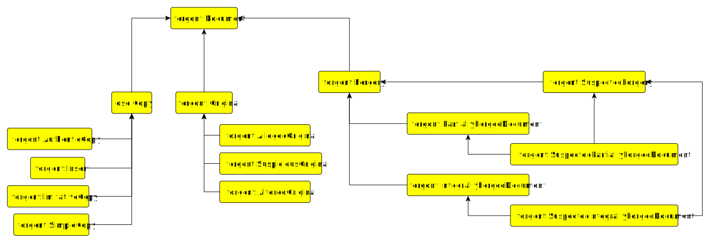
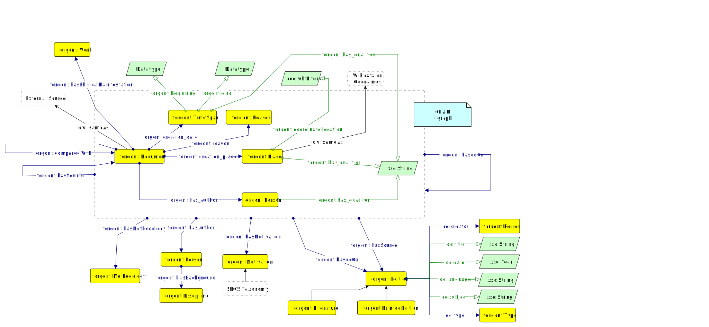

# Forgont 

## Document Types

1. **Document**: A document is a recorded or written representation of information, often in written or digital form.

2. **Original**: An original refers to the initial or primary version of a document, created directly by the author or source.

3. **Alleged Original**: An alleged original is a document that is claimed to be the original but may be subject to dispute or doubt.

4. **Suspicious Original**: A suspicious original is an original document that raises concerns or doubts about its authenticity or legitimacy.

5. **Copy**: A copy is a reproduction or duplicate of an original document, often made to distribute or preserve information.

6. **Authentic Copy**: An authentic copy is a duplicate of an original document that is verified to be genuine and accurate.

7. **Insert**: An insert is additional content or material added into an existing document.

8. **Imitative Copy**: An imitative copy is a reproduction of an original document created with the intent to closely mimic the original.

9. **Simple Copy**: A simple copy is a straightforward duplication of an existing document without any attempt to alter or mimic the original.

10. **Forgery**: Forgery refers to the act of creating or altering a document, signature, or object with the intent to deceive or defraud by passing it off as genuine.

11. **Suspected Forgery**: A suspected forgery is a document or item that is believed to be a result of forgery, but its authenticity has not been confirmed.

12. **Integrally Forged Document**: An integrally forged document is one that has been entirely fabricated or altered, often to deceive others.

13. **Partially Forged Document**: A partially forged document is one in which only a portion of the content has been fabricated or altered, while other parts remain genuine.

## Authenticity assessments 

- **Authenticity Assessment claim**
  - Location of creation assignment
  - Time of creation assignment
  - Author assignment
  - Physical document type assignement

- **Fuzziness handling**:
  - Fuzzy dates are recorded as timespans
  - Qualifiers are added to each triple of the claim GRAPH

- **Critical discourse representation**
  - Author of the claim
  - Motivation of the claim
  - Source of the claim
  - Other claims or Editions considered as being the background of the claim

## Motivations

Qualitative document analysis

****
#### Intrinsic features
- metre and style 
- orthography 
- inter-punctuation 
- indentation 
- legal formulas 
- terminology 
- document structure
- format - spacing 
- format - signs 
- format - interpolations
- chronology 
- document content

#### Estrinsic features
- ink   
- support 
- sigillum (or seal)
- document authentication
- hand 

#### Context
- historical context
- literary framework

