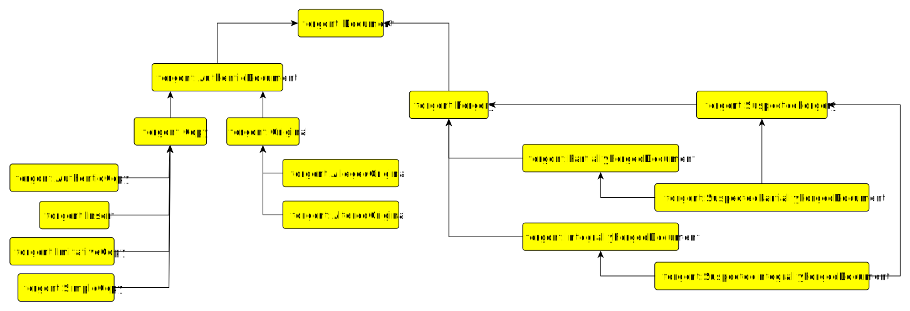
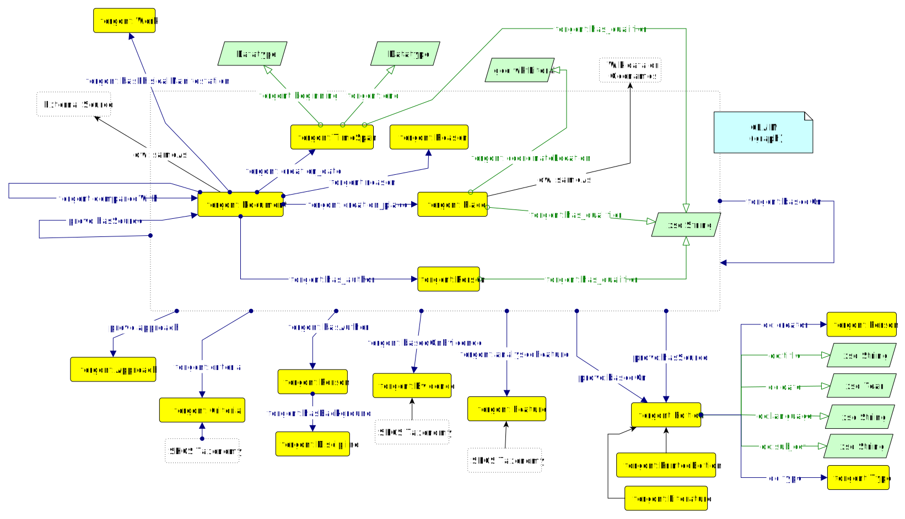

# Forgont 

## Document Types

1. **Document**: A document is a recorded or written representation of information, often in written or digital form.

2. **Original**: An original refers to the initial or primary version of a document, created directly by the author or source.

3. **Alleged Original**: An alleged original is a document that is claimed to be the original but may be subject to dispute or doubt.

4. **Suspicious Original**: A suspicious original is an original document that raises concerns or doubts about its authenticity or legitimacy.

5. **Copy**: A copy is a reproduction or duplicate of an original document, often made to distribute or preserve information.

6. **Authentic Copy**: An authentic copy is a duplicate of an original document that is verified to be genuine and accurate.

7. **Insert**: An insert is additional content or material added into an existing document.

8. **Imitative Copy**: An imitative copy is a reproduction of an original document created with the intent to closely mimic the original.

9. **Simple Copy**: A simple copy is a straightforward duplication of an existing document without any attempt to alter or mimic the original.

10. **Forgery**: Forgery refers to the act of creating or altering a document, signature, or object with the intent to deceive or defraud by passing it off as genuine.

11. **Suspected Forgery**: A suspected forgery is a document or item that is believed to be a result of forgery, but its authenticity has not been confirmed.

12. **Integrally Forged Document**: An integrally forged document is one that has been entirely fabricated or altered, often to deceive others.

13. **Partially Forged Document**: A partially forged document is one in which only a portion of the content has been fabricated or altered, while other parts remain genuine.

## Authenticity assessments 

- **Authenticity Assessment claim**
  - Location of creation assignment
  - Time of creation assignment
  - Author assignment
  - Physical document type assignement

- **Fuzziness handling**:
  - Fuzzy dates are recorded as timespans
  - Qualifiers are added to each triple of the claim GRAPH

- **Critical discourse representation**
  - Author of the claim
  - Motivation of the claim
  - Source of the claim
  - Other claims or Editions considered as being the background of the claim

## Object Properties
### Claim object properties
- **forgont:has_author**: The author of the claim
- **forgont:has_background**: The scholarly background of the scholar
- **forgont:based_on_evidence**: Describes the evidences collected to support the claim conclusion 
- **forgont:criteria**: Describes the criteria (or analysis) used to reach the conclusion declared by the claim
- **forgont:consider_compared_document**: Describe the set of documents which has been compared to the one under analysis described by the claim
- **provo:has_source**: Describe the set of sources on which the claim has been based on
- **provo:based_on**: Describe the source on which the claim has been published

## Features
### Qualitative document analysis
#### Estrinsic features - Medium:
- ink   
- support 
- sigillum (or seal)
- document authentication
- handwriting

#### Intrinsic features - Contents and Structure
- metre and style 
- orthography 
- inter-punctuation 
- indentation 
- legal formulas 
- terminology 
- document structure
- format - spacing 
- format - signs 
- format - interpolations
- chronology 
- document content
- dating

#### Context
- historical context
- literary framework
- List of witnesses
- Document provenance

## Evidence
- **extrinsic features chronological accuracy**
- **material anachronisms**: Presence of anachronistic materials or inconsistencies in material properties within the purported time
- **chronological accuracy**: Consistent in material properties within the purported time
- **extrinsic features Authenticity**:
  - **material internal consistency**: Verification of the consistency of use of materials in the surveyed document
  - **material internal inconsistency**
  - **lack of external confirmation**
  - **External Confirmation**: Analysis of materials for compatibility with the claimed era, or any materials inconsistent with the historical context or materials against historical records
 
## Criteria adopted on intrinsic features  
  - **Correct usage**
  - **Misusage**
  - **Content lack of credibility**
  - **Content credibility**
  - **Unverified historical contents**
  - **Internal Consistency**: Check for consistency within the document regarding dates, events, and details. Internal contradictions may raise questions about authenticity
  - **External Confirmation**: Verify the information in the document against other historical sources or records from the same period
  
## Criteria adopted on provenance information
- **Documentary Evidence Criteria**
  - **Verified Provenance**: If the origin and chain of custody of the document can be traced and verified through reliable sources and documentation, it can be considered as having a verified provenance.
  - **Incomplete Provenance**: If there are gaps or missing links in the origin or chain of custody, the provenance is considered incomplete. This may raise questions about the document's authenticity and reliability.
  - **Disputed Provenance**: If there are conflicting accounts or disputes regarding the origin or chain of custody, the provenance is considered disputed. This may require further investigation to resolve inconsistencies.
  - **Doubtful Provenance**: If there are reasonable doubts about the authenticity of the provenance, it is categorized as doubtful. This could be due to inconsistencies, lack of supporting evidence, or questionable sources.
  - **Document Loss**: If the historical document is confirmed to be lost or missing, it affects the provenance. In such cases, efforts to recover or reconstruct the provenance become crucial.
- **Witness Testimony Criteria**
  - **Credibility of Witnesses**: Assess the credibility of the witnesses. Consider factors such as their expertise, reliability, and potential biases. Reliable witnesses with firsthand knowledge or expertise in relevant fields enhance the credibility of the document's provenance.
  - **Consistency in Testimonies**: Look for consistency in the testimonies of multiple witnesses. Consistent accounts strengthen the reliability of the provenance, while conflicting or inconsistent statements may raise doubts.
  - **Inconsistency in Testimonies**: Look for consistency in the testimonies of multiple witnesses. Consistent accounts strengthen the reliability of the provenance, while conflicting or inconsistent statements may raise doubts.
  - **Lack of Credibility of Witnesses**: Assess the credibility of the witnesses. Consider factors such as their expertise, reliability, and potential biases. Reliable witnesses with firsthand knowledge or expertise in relevant fields enhance the credibility of the document's provenance.

- **Other criteria**
  - **Holistic Assessment**: Scholars emphasize a holistic approach, considering the collective weight of evidence. While individual criteria contribute to the assessment, scholars recognize the need to balance positive indicators with potential red flags.
  - **Expert Involvement**: Depending on the complexity of the document, scholars may involve experts in relevant fields (historians, archivists, forensic experts) to provide specialized insights and analysis.

### Types of analysis
- Scientific analysis
- Historical analysis
- Philologic analysis
- Diplomatic analysis
- Literary analysis

